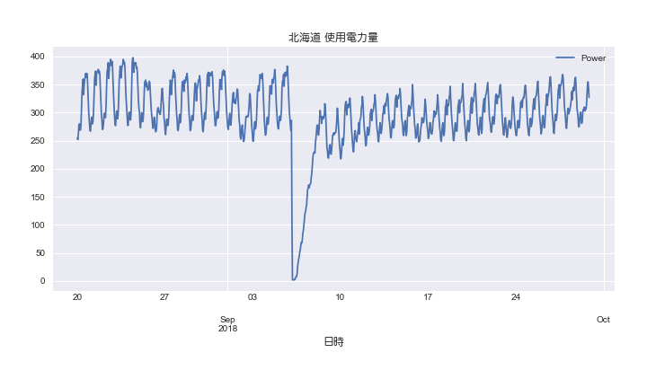

# ほくでん過去の電力使用状況データ

「北海道エリアのでんき予報 過去の電力使用状況データのダウンロード」のページからダウンロードしたzipファイルを展開し、各CSVファイルから
1時間ごとの当日実績、予測値、使用率の抜き出して連結したものです。

http://denkiyoho.hepco.co.jp/area_download.html

## 9月7日以降のデータについて

2018年9月7日以降は、北電が公開している電力データはすべて０になっているため、データがありません。

## 取り扱い・免責事項について

本データの扱いについては、北海道電力株式会社の「取り扱い・免責事項について」を一読の上、利用ください。

http://denkiyoho.hepco.co.jp/area_disclaimer.html

## データのプロット

2016年以降の電力使用量

2018年8月30日以降の予測値と電力使用量

